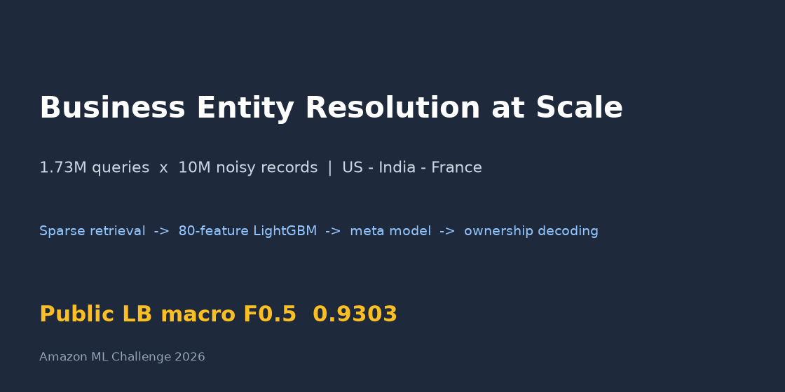
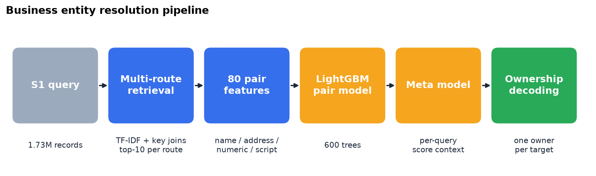
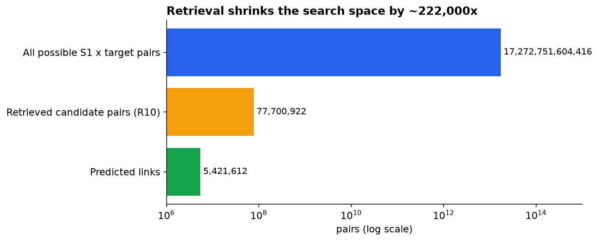
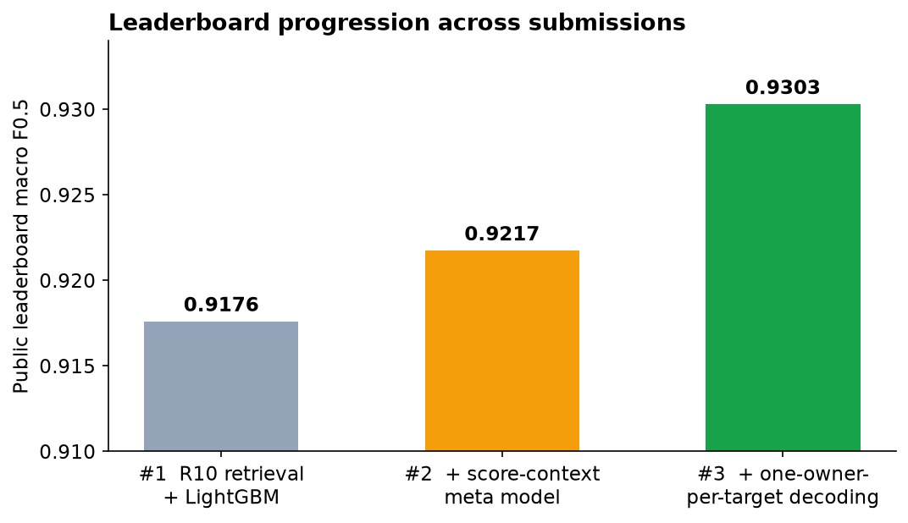
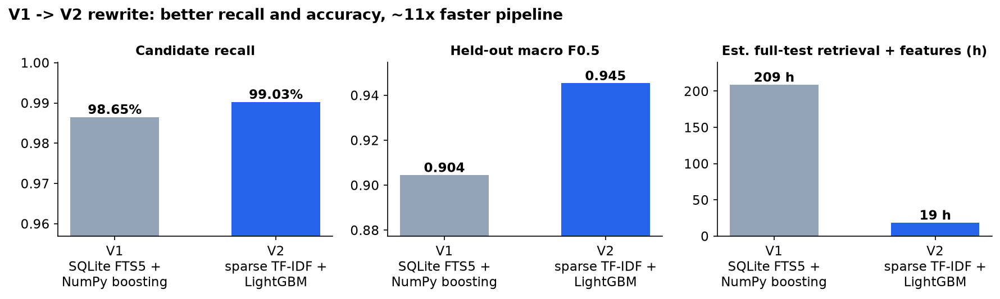
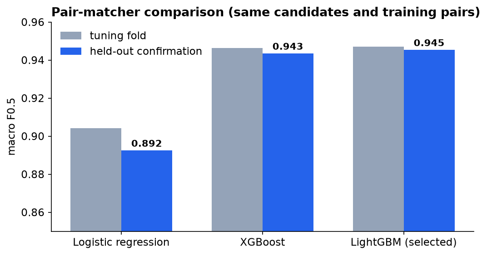
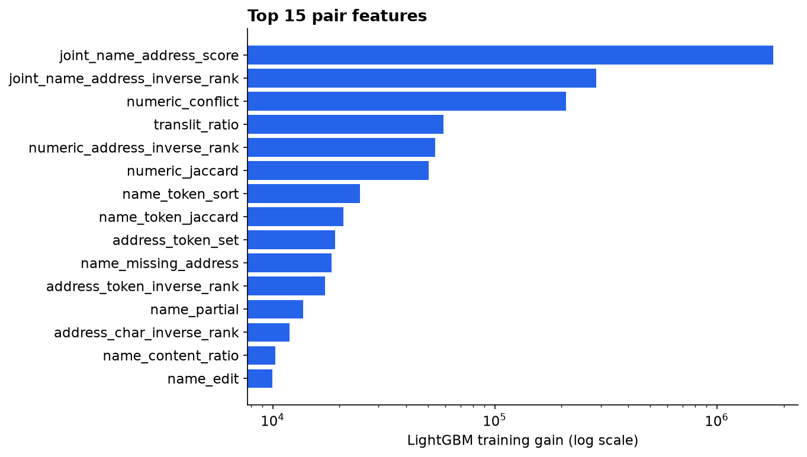
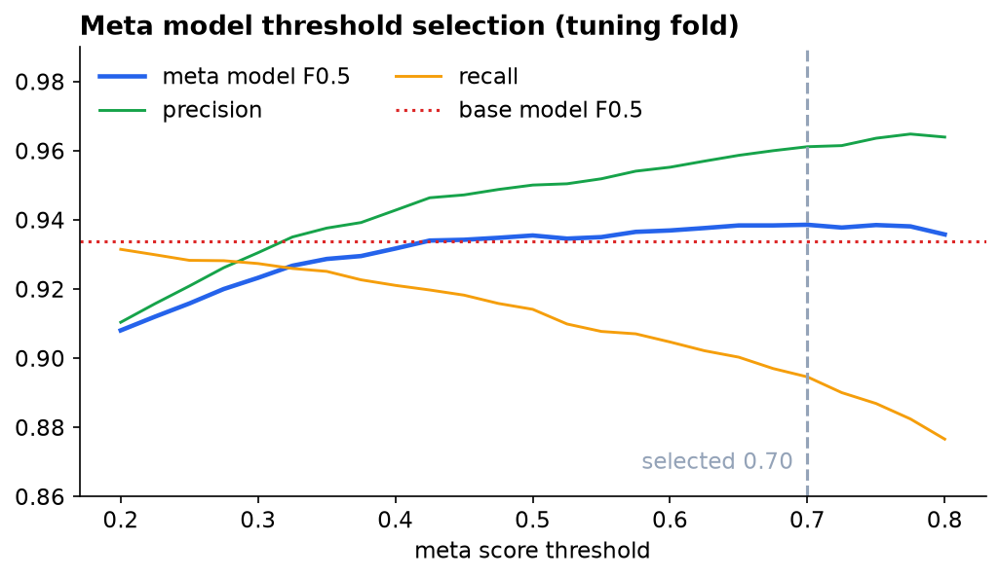
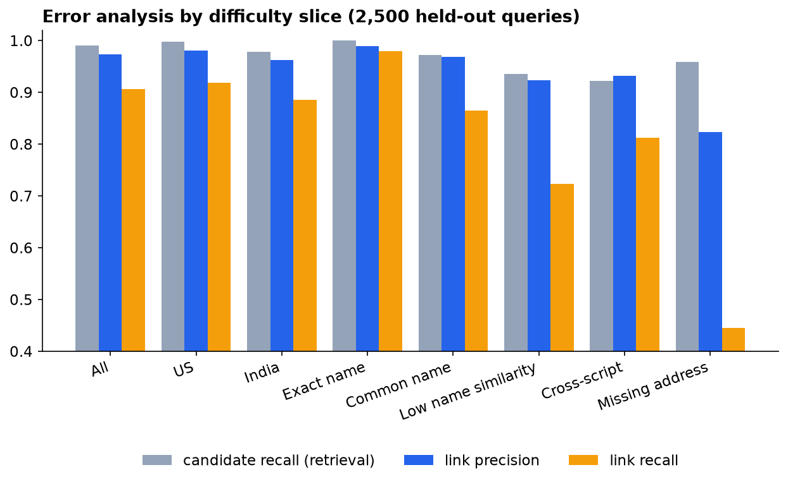
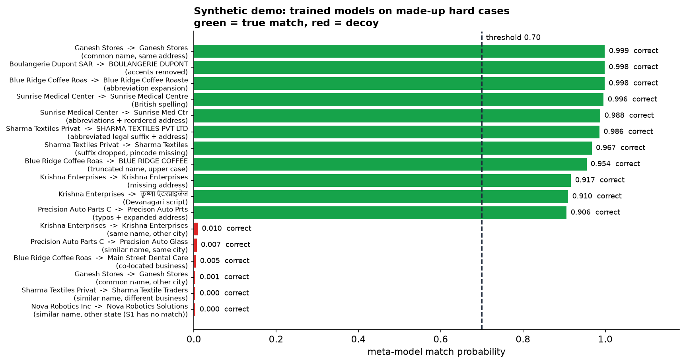

# Business Entity Resolution at Scale: Amazon ML Challenge 2026



Our solution matches every business record in Source 1 to all records for the same real-world business in Source 2 and Source 3. The scale is 1.73M test queries against about 10M candidate records across the US, India and France. Records contain noisy names, reordered or partial addresses, Indic scripts and missing fields.

| Result | Score |
|---|---|
| Public leaderboard, macro F0.5 (best of 3 submissions) | **0.9303** |
| Local held-out confirmation, macro F0.5 | 0.9453 (top-100 candidates) / 0.9438 (fast R10 profile + meta model) |
| Candidate recall, retrieval stage | 99.03% (top-100) / 97.32% (fast R10 profile) |
| Full test inference | 1,732,544 queries → 77.7M scored pairs → 5.4M predicted links on one 16 GB laptop |

No pretrained models, external data or GPUs were used. Every model was trained from scratch on the challenge labels.

- Trained models: [Hugging Face](https://huggingface.co/sanjayrohith/business-entity-resolution-lightgbm) · [Kaggle dataset](https://www.kaggle.com/datasets/sanjayrohith/business-entity-resolution-models)
- Write-up notebook: [Kaggle](https://www.kaggle.com/code/sanjayrohith/business-entity-resolution-writeup)
- Try it without the challenge data: [synthetic end-to-end demo](#try-it-synthetic-end-to-end-demo)

## Approach



1. **Candidate retrieval (blocking).** Separate indexes are built for S2 and S3. Ten routes are merged and deduplicated:
   - hashed binary TF-IDF on name words and 3–5-grams, address words and trigrams, and joint name+address, using native sparse top-k over 250k-row partitions;
   - batched SQL joins for exact names, legal-suffix-stripped names and sorted address-token keys;
   - rescue routes for non-Latin names (AnyAscii transliteration 2–4-grams) and for missing-address records.

   Every route is country-agnostic, and no dense similarity matrix is ever built.
2. **Pair features (80).** Name similarity (RapidFuzz Indel, token set/sort, gram Jaccard, containment, truncation), address token/character/partial overlap, numeric and postal agreement or conflict, transliteration similarity, name frequency, missingness, and route hit/rank/score for each route.
3. **Pair classifier.** LightGBM was compared with XGBoost and logistic regression. Positives, hard negatives and weighted tail negatives are sampled only from retrieved candidates, so no ground-truth positive is ever injected.
4. **Score-context meta model.** A second LightGBM model sees each candidate's base score next to its S1-level context: rank, gap to the top candidate, counts above several thresholds, and the other source's top score. It raised held-out F0.5 from 0.9363 to 0.9438 (paired bootstrap 95% CI of the gain: [+0.0043, +0.0106]).
5. **Target exclusivity.** In the training labels every S2/S3 record belongs to exactly one S1 entity. When several S1 entities claim the same target, the target goes to the one with the highest meta score, but only if it leads by at least 0.05; otherwise the target is dropped. This gave the final leaderboard gain (0.9217 → 0.9303).

Thresholds maximize the exact per-S1 macro F0.5 on a tuning fold. Held-out confirmation folds are grouped by name/address keys to avoid leakage, and they were scored only after all choices were frozen.



## Results



| # | Change | Local confirmation F0.5 | Public LB F0.5 |
|---|---|---|---|
| 1 | Fast R10 retrieval profile + LightGBM (threshold 0.642) | 0.9363 | 0.9176 |
| 2 | + score-context meta model (threshold 0.70) | 0.9438 | 0.9217 |
| 3 | + one-owner-per-target conflict resolution (margin 0.05) | 0.9221 on a repeated-name stress set (+0.0020) | **0.9303** |

The pipeline was rewritten once during the challenge. V1 used SQLite FTS5 retrieval with a NumPy boosting model; V2 replaced it with sparse hashed TF-IDF and LightGBM:



All three pair matchers were trained on the same candidates and pairs:



The top features show that retrieval-route evidence (joint name+address score and rank) matters as much as string similarity:



The meta-model threshold was chosen on the tuning fold only:



### Error analysis



- Retrieval is strong on every slice (≥92% candidate recall). Most losses happen in the matcher, which is conservative by design because F0.5 weights precision.
- **Missing addresses** are the weakest slice. Without an address, a name alone is often not enough evidence, so link recall is 44%.
- **Low-name-similarity** and **cross-script** (Indic script vs Latin) pairs are next, with link recall of 72% and 81%.
- The largest group of false positives has strong address similarity, which often means **co-located businesses**: different companies at the same address.

Rejected experiments are documented in [docs/experiment_log.md](docs/experiment_log.md): adaptive cardinality thresholds, a 119-point decoder grid, and an extra R20 targeted retrieval pass. They were dropped because they did not produce a robust gain of at least 0.002 on two independent held-out slices.

## Try it: synthetic end-to-end demo

The challenge data can't be published, so `demo/er_demo.py` runs the **same pipeline at small scale** on made-up records. Eight queries are designed around the hard cases above, and the corpus is filled out with 700 generated businesses. The demo runs:

- the fast R10 retrieval routes, using the same vectorizer settings as production;
- the exact 80 production features (checked against the real feature code on all 247 demo pairs);
- the trained base and meta models, then ownership decoding.

```bash
pip install -r requirements.txt
python demo/er_demo.py
```



| Hard case | Example | Decision |
|---|---|---|
| Legal-suffix abbreviation | Sharma Textiles Private Limited → SHARMA TEXTILES PVT LTD | ✅ match (0.986) |
| Devanagari script | Krishna Enterprises → कृष्णा एंटरप्राइजेज | ✅ match (0.910) |
| Missing address | Krishna Enterprises → Krishna Enterprises (no address) | ✅ match (0.917) |
| Typos | Precision Auto Parts Co → Precison Auto Prts | ✅ match (0.906) |
| Same common name, other city | Ganesh Stores (Pune) → Ganesh Stores (Chennai) | ❌ rejected (0.001) |
| Co-located business | Blue Ridge Coffee Roasters → Main Street Dental Care, same building | ❌ rejected (0.005) |
| Query with no true match | Nova Robotics Inc → Nova Robotics Solutions (other state) | ❌ rejected, empty prediction |

All 8 synthetic queries are resolved correctly. The demo cases are much easier than the real data, where held-out F0.5 is 0.94, so read the demo as an illustration of the pipeline, not a benchmark.

## Repository layout

```
code/business_entity_resolution/
  src/        V1: normalization, SQLite FTS5 retrieval, NumPy models, metric + tests
  v2/         V2: sparse hashed retrieval, targeted routes, 80 features, model selection + tests
distributed/  Full-test inference: index build, sharded workers, checkpointed R10 inference,
              meta-model training, ownership decoding, merge/validation
demo/         Synthetic end-to-end demo (runs without challenge data)
artifacts/    Frozen model files and manifests used by the preflight checks
docs/         Validation report, experiment log, structural audit, distributed-run guide, charts
```

## Reproducing on the challenge data

Requirements: Python 3.12 and Windows PowerShell (the scripts are `.ps1`, but the Python code is portable). You also need the official challenge data under `dataset/train/` and `dataset/test/`. **The data is not included** and must be obtained from the challenge organizers.

```powershell
python -m pip install -r requirements.txt

# V1 baseline (SQLite FTS5 indexes, 6,000-entity grouped validation)
& ./code/business_entity_resolution/reproduce.ps1 -Stage Full -Python python

# V2 (sparse retrieval, 80 features, LightGBM/XGBoost/logistic comparison)
& ./code/business_entity_resolution/v2/reproduce.ps1 -Stage Prepare -Python python
& ./code/business_entity_resolution/v2/reproduce.ps1 -Stage Validation -Python python
& ./code/business_entity_resolution/v2/reproduce.ps1 -Stage Verify -Python python

# Full test inference (R10 profile), then meta model and ownership decoding
python distributed/test_indexes.py build --source 2
python distributed/test_indexes.py build --source 3
python distributed/deadline_inference.py run
python distributed/finalize_deadline.py
python distributed/recovery_prepare_fresh.py
python distributed/recovery_fresh_inference.py run
python distributed/recovery_meta_experiment.py
python distributed/recovery_full_inference.py run
python distributed/recovery_finalize.py
python distributed/recovery_ownership_submission.py
```

The test indexes alone take about 17 GB of disk, and the training indexes add more. Full test inference took about 6.4 compute-hours on a 16 GB laptop. The distributed worker path splits it across several machines; see [docs/distributed_inference.md](docs/distributed_inference.md).

## Limitations

- France has no training labels, so French quality is unmeasured.
- The fast R10 profile gives up about 1.7 points of candidate recall to fit the deadline.
- Cross-script and missing-address links remain the hardest slices.

## License

The code is MIT licensed (see [LICENSE](LICENSE)). Dependencies: LightGBM (MIT), XGBoost (Apache-2.0), AnyAscii (ISC), sparse-dot-topn (Apache-2.0). The challenge dataset is not redistributed.
